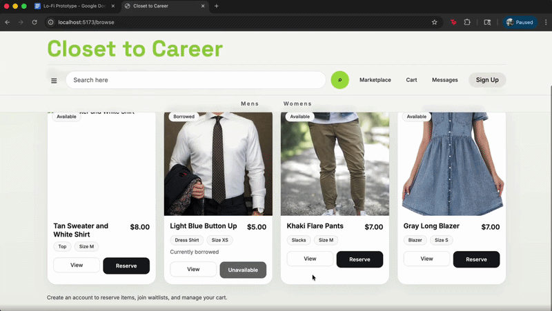
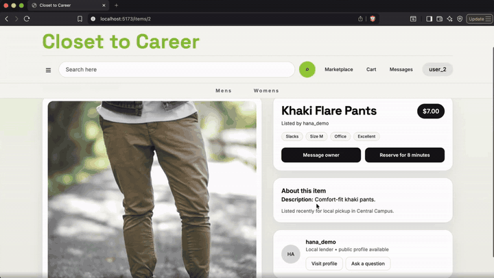
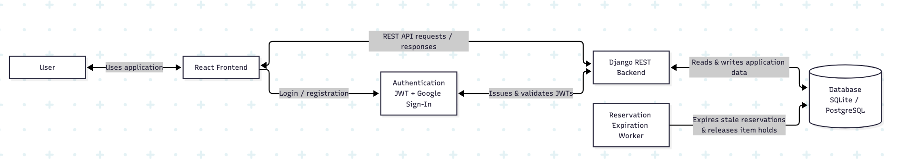
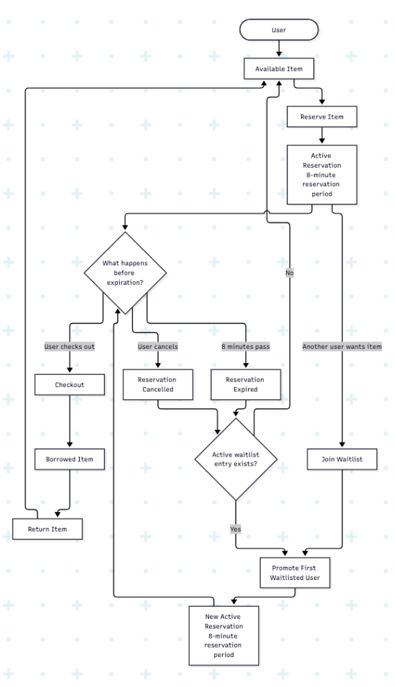

# Closet to Career


Closet to Career connects adults seeking formal attire for professional occasions with individuals who want to earn passive income by lending clothing they already own. Our mission is to make professional clothing more accessble. 

On the platform, users can view indvidual items, reserve them, and check out their reservations. They can also list their own clothing for others to borrow. 

---

## Table of Contents

1. Getting Started
2. Features
3. Architecture
4. Borrowing items using Closet to Career
6. FAQ

---

## Getting Started

Closet to Career consists of a Django backend and React frontend, both of which need to be running locally. 

### Backend Setup

Create a backend directory, navigate to it, and create a Python virtual environment within it. A precursor to this step is having Python installed.

```bash
cd backend
python3 -m venv .venv
source .venv/bin/activate
pip install -r requirements.txt
cp .env.example .env
```

Apply the database migrations and load the demo data.

```bash
python manage.py migrate
python manage.py seed_demo
```

Start the backend server.

```bash
python manage.py runserver
```

The backend API will run at the base URL:

```text
http://127.0.0.1:8000/api
```

### Setting up Reservation Expiration Worker

Closet to Career uses a background worker to release reservations after their eight-minute reservation period expires.

In a second backend terminal, run:

```bash
cd backend
source .venv/bin/activate
python manage.py run_expirer –-seconds 15
```

### Frontend Setup

In a thid terminal terminal, run:

```bash
cd frontend
cp .env.example .env
npm install
npm run dev
```

The frontend will run at:

```text
http://localhost:5173
```

---

## Features

### Browse Professional Clothing

Users can browse and filter clothing currently listed on Closet to Career to find an item that fits their needs.

Selecting an item opens its detail page. Here, users can see additional information about the item before deciding to reserve it.



### Checkout

Users must reserve an item before checking it out. Each reservation is held for eight minutes before being made available to other users again; a live coutdown shows how much time is left. When a user decides to the borrow the item, it will no longer be available to other users.



### Waitlist

If another user is already holding an item, another interested user can join its waitlist. In the case the original reservation expires, the next eligible users receives the reservation. 

### List Clothing

User can also post items they own by providing information about the item through the Post Item page.

---

## Architecture

The React frontend provides the user interface for browsing, reserving, checking out, and listing clothing. It communicates with REST API requests through the Django backend, which handles authentication, user profiles, items, reservations, and checkout. It also reads and writes the application’s persistent data through the database.

A separate reservation expiration worker periodically checks for reservations that have exceeded the eight-minute hold period. Expired reservations are released so that the item can become available to another user.



---

## Borrowing items using Closet to Career

Most users on the platform will be borrowers. A typical borrowing flow looks like this:

1. Create an account or log in.
2. Browse available professional clothing.
3. Select an item to view its details.
4. Reserve the item.
5. Open the cart and review the reservation.
6. Complete checkout before the eight-minute timer expires.
7. The item is marked as borrowed.

The process can further be visualized with this architecture diagram.



---

## FAQ

### Why does a reservation only last eight minutes?

The reservation period prevents an item from being held indefinitely. It gives the user time to finish checkout while still allowing the item to become available again if the user forgets / no longer wants it.

### Can I use Closet to Career without PostgreSQL?

Yes. The application can use SQLite for a simple local development environment. PostgreSQL is also supported.

### How can I load items without manually creating them? For testing purposes.

Run:

```bash
python manage.py seed_demo
```

This populates the application with demo data that can be used to test the main workflows.

### Can the same account both borrow and list clothing?

Yes. Accounts are not separated into borrower and lender account types.

### Does Closet to Career support Google sign-in?

Yes. Google sign-in is supported when the appropriate Google OAuth client IDs are configured in the backend and frontend environment files.